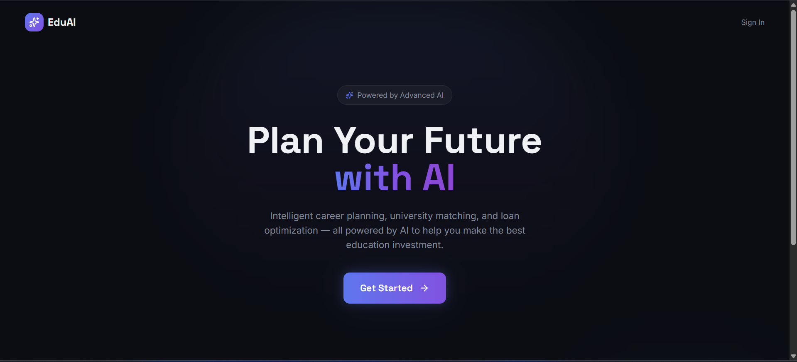

# Welcome to Kailash App – Future Path AI project

## Live Demo

[](https://future-path-ai-sable.vercel.app/)

---

## Preview


## Setup Instructions

### 1. Install Dependencies
```bash
cd backend
npm install
```

### 2. Configure Database
- Copy `.env.example` to `.env`
- Update database credentials (host, user, password, database name)

### 3. Run Migrations
```bash
npm run migrate
```

### 4. Start Development Server
```bash
npm run dev
```

The server will run on `http://localhost:4000`

## Rollback Database
```bash
npm run rollback
```

## Project Structure

```
backend/
├── config/
│   └── database.js          # Database configuration & models
├── models/
│   ├── user.js              # User model
│   ├── ticket.js            # Ticket model
│   ├── ticketComment.js     # Ticket comments/replies
│   ├── activityLog.js       # Activity logging
│   └── supportAssignment.js # Support staff assignment
├── routes/
│   ├── users.js             # User authentication & management
│   ├── tickets.js           # Ticket CRUD operations
│   └── admin.js             # Admin dashboard & management
├── migrations/
│   ├── migrate.js           # Database migration script
│   └── rollback.js          # Database rollback script
├── utils/
│   └── auth.js              # Authentication utilities
├── index.js                 # Main server file
├── package.json             # Dependencies
└── .env.example             # Environment variables template
```

## API Endpoints

### Users
- `POST /api/users/register` - Register new user
- `POST /api/users/login` - Login user
- `GET /api/users` - Get all users (admin only)
- `GET /api/users/:id` - Get user by ID
- `PUT /api/users/:id` - Update user profile
- `PATCH /api/users/:id/role` - Change user role (admin only)
- `DELETE /api/users/:id` - Delete user (admin only)
- `POST /api/users/logout` - Logout user

### Tickets
- `GET /api/tickets` - Get all tickets
- `GET /api/tickets/:id` - Get ticket by ID
- `POST /api/tickets` - Create new ticket
- `PUT /api/tickets/:id` - Update ticket
- `PATCH /api/tickets/:id/assign` - Assign ticket to support staff
- `PATCH /api/tickets/:id/close` - Close/resolve ticket
- `DELETE /api/tickets/:id` - Delete ticket

### Admin
- `GET /api/admin/dashboard` - Get dashboard statistics
- `GET /api/admin/users` - Get all users
- `GET /api/admin/tickets` - Get all tickets overview
- `GET /api/admin/tickets/status/:status` - Get tickets by status
- `PATCH /api/admin/tickets/:ticketId/reassign` - Reassign ticket
- `PATCH /api/admin/tickets/:ticketId/resolve` - Resolve ticket
- `PATCH /api/admin/users/:userId/promote-support` - Promote to support staff
- `PATCH /api/admin/users/:userId/demote` - Demote support staff
- `DELETE /api/admin/users/:userId` - Delete user
- `GET /api/admin/logs` - Get activity logs
- `GET /api/admin/reports/tickets` - Generate tickets report

## Database Schema

### Users Table
- id (Integer, PK)
- name (String)
- email (String, Unique)
- password (String)
- role (Enum: 'user', 'admin', 'support')

### Tickets Table
- id (Integer, PK)
- title (String)
- description (Text)
- status (Enum: 'open', 'in_progress', 'closed')
- userId (Integer, FK)
- assignedTo (Integer, FK)

### TicketComments Table
- id (Integer, PK)
- comment (Text)
- ticketId (Integer, FK)
- userId (Integer, FK)
- createdAt (DateTime)

### ActivityLogs Table
- id (Integer, PK)
- action (String)
- entity (String)
- entityId (Integer)
- userId (Integer, FK)
- details (JSON)
- createdAt (DateTime)

### SupportAssignments Table
- id (Integer, PK)
- supportStaffId (Integer, FK)
- activeTickets (Integer)
- maxCapacity (Integer)
- isAvailable (Boolean)

## Dependencies

- **express** - Web framework
- **sequelize** - ORM for database
- **mysql2** - MySQL client
- **bcryptjs** - Password hashing
- **jsonwebtoken** - JWT token generation
- **body-parser** - Request body parsing
- **cors** - Cross-Origin Resource Sharing
- **dotenv** - Environment variables

## Next Steps

1. Implement actual CRUD logic in routes
2. Add input validation and error handling
3. Add authentication middleware to protected routes
4. Implement email notifications for ticket updates
5. Add pagination and filtering
6. Create frontend API integration
7. Add comprehensive logging and monitoring
8. Deploy to production server